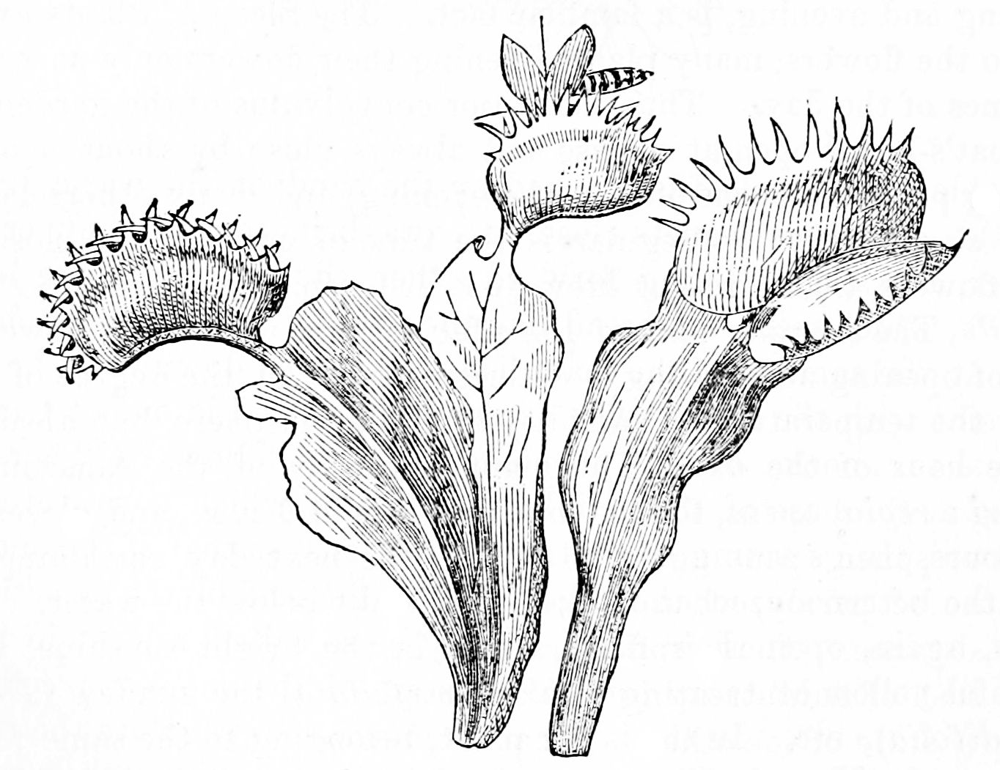

Venus
=====

Centralised logging

Development Setup
-----------------

The easy way to install for development is the following:

.. code-block:: bash

    $ pip install -e .[all]

This installs ``venus`` in dev mode (editable install), and all the
required development packages.

Querying data
-------------

Logging data is stored with the following schema:

.. code-block::

    time: timestamp with time zone
    message: text
    correlation_id: uuid
    data: jsonb

When applications send their logging data over, each message will be
a JSON message that looks something like this:

.. code-block:: json

    {
        "name": "root",
        "msg": "blah blah blah",
        "args": [],
        "levelname": "INFO",
        "levelno": 20,
        "pathname": "tests/sender.py",
        "filename": "sender.py",
        "module": "sender",
        "exc_text": null,
        "stack_info": null,
        "lineno": 59,
        "funcName": "app_items",
        "created": 1554635562.8368905,
        "msecs": 836.890459060669,
        "relativeCreated": 1485.8589172363281,
        "thread": 15368,
        "threadName": "MainThread",
        "processName": "MainProcess",
        "process": 11604,
        "correlation_id": "8e820a74-ef80-4fbe-a4f7-692f6352b6be",
        "random_timing_data": 1.23,
        "message": "blah blah blah",
        "created_iso": "2019-04-07T11:12:42.836890+00:00"
    }

What happens is that *venus* will

#. write ``created_iso`` message field to the ``time`` DB field;
#. write ``message`` message field to the ``message`` DB field;
#. write ``correlation_id`` message field to the ``correlation_id`` DB field;
#. remove some fields from the JSON blob (based on a configurable ignore list)
#. write the *entire JSON blob* to the ``data`` DB field.

This is how the logging data gets into the database.

When you want to query the database, typically one would specify a
correlation id and perhaps also a time constraint. If you want to get back
specific fields in the JSON blob,  you must use the JSONB operators and
functions for that. However, there is also a shortcut way to decompose the
JSONB blob into dedicated columns, assuming you know what type they need
to be.

Here is an example of querying such data:

.. code-block:: sql

    select
        time,
        created_iso,
        *,
        logs.data->>'filename',  # This is the normal way to access JSONB
        logs.data#>>'{filename}'
    from
         logs,
         LATERAL jsonb_to_record(logs.data) as x(
             msg text,  -- Need to know which names you're looking for
             filename text,
             pathname text,
             levelno int,
             lineno int,
             randon_timing_data double precision,
             created_iso text
         )
    where filename = 'sender.py'  -- Can constrain on the new fields
    order by time desc
    limit 10;

Of course, if you need to constrain JSONB subfields in the ``WHERE`` clause
it'll be more efficient to use the JSONB operators directly so that the
GIN index on the ``data`` field can be used.
